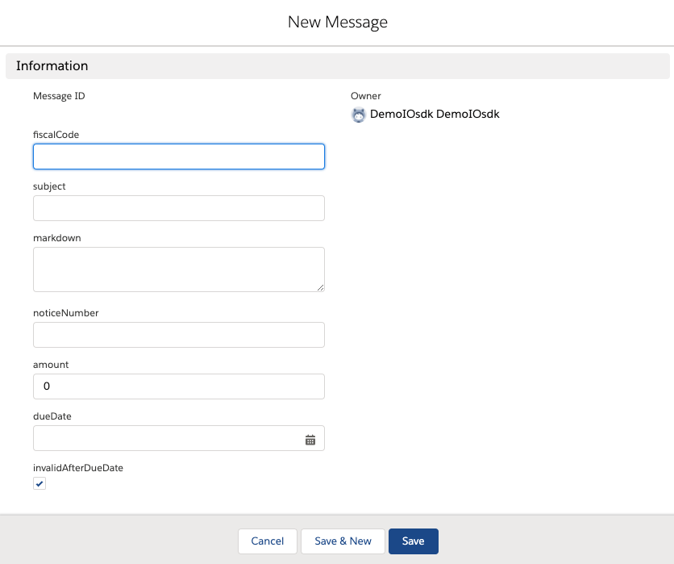
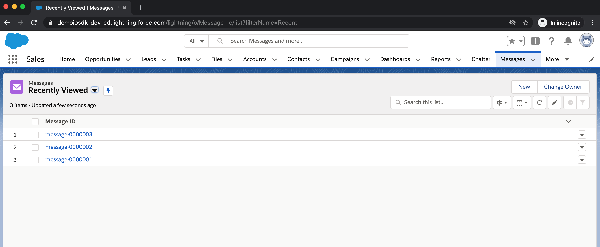
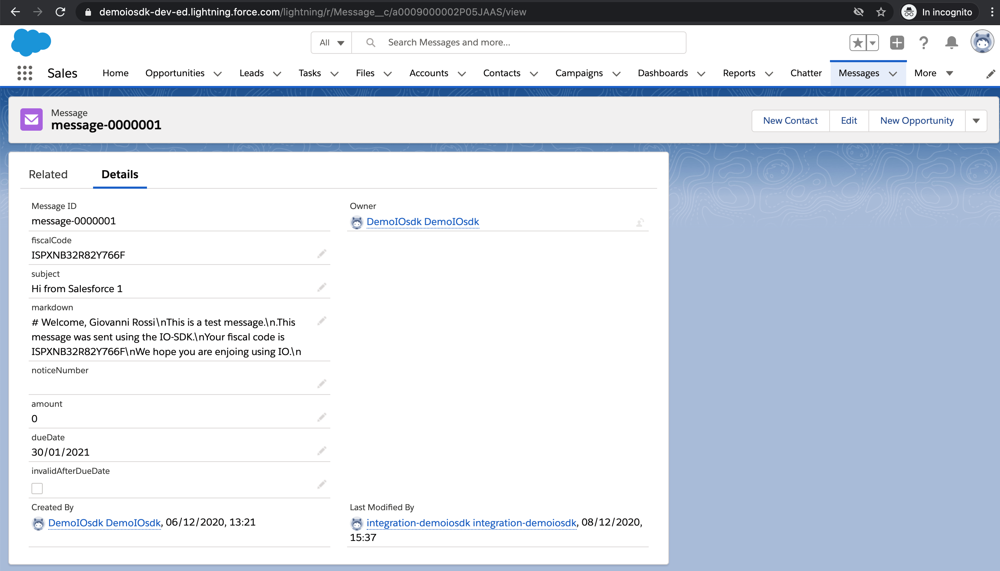
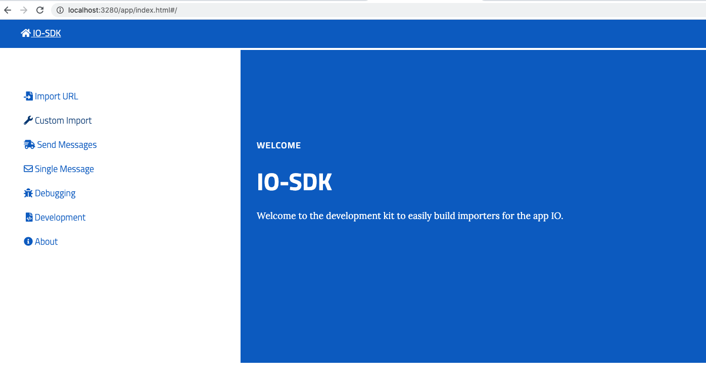
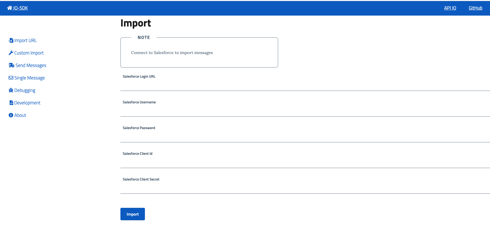
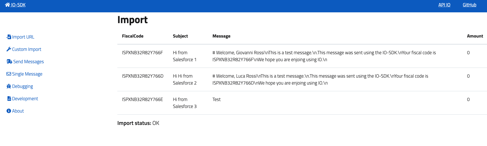

# Salesforce Java 8 Connector
Salesforce importer for [IO-Gateway](https://github.com/pagopa/io-gateway).  

The connector reads the data from an custom Salesforce Object named "**Message**".

# Prerequisites

### IO-Gateway installation
Install [IO-Gateway](https://github.com/pagopa/io-gateway)

### Salesforce credentials
In order to import the Messages from salesforce you need the following Salesforce credentials:

- **Salesforce Login Url**:  Salesforce endpoint to authenticate the connector
    - for Salesforce Production Org use 'https://login.salesforce.com/services/oauth2/token'
    - for Salesforce Developer Sandbox use 'https://test.salesforce.com/services/oauth2/token'

- **Salesforce Login**: Salesforce username to authenticate the connector
- **Salesforce Password**: Salesforce password to authenticate the connector
- **Salesforce client_id**: Salesforce ConnectedApp client_id to authenticate the connector
- **Salesforce client_secret**: Salesforce ConnectedApp client_secret to authenticate the connector

### Salesforce Message Object
The connector reads the messages from a custom object named "Message". 

The "Message" Object must contains the following fields:

- **fiscalCode**: Text field
- **subject**: Text field
- **markdown**: Long Text Area
- **amount**: Number field
- **dueDate**: Date field
- **invalidAfterDueDate**: Checkbox field

and the mandatory Salesforce Object Id and Name.

**Note the object can contains also other fields but these are mandatory**

Please create the Message Object into your Salesforce Org/Sandbox.




# Development

# Prerequisites
- Install maven (3.X.X)
- Install Java 8

### Build and Assembly the connector

##### Clone the repo
```git clone https://github.com/pagopa/io-gateway-connectors.git```

##### Run the unit tests
```
cd io-gateway-connectors/salesforce-java8
mvn clean test
```

##### Run the integration tests [**OPTIONAL**]
The integration tests verifies the end2end integration with a Real Salesforce Org/Sandbox.

To run the integration tests you need to provide your credentials into the file src/test/resources/payload.json

```
{
   "salesforceLoginUrl" : "https://login.salesforce.com/services/oauth2/token",
   "username":"<Put your username>",
   "password" : "<Put your password>",
   "clientId" : "<Put your client_id>",
   "clientSecret" : "<Put your client_secret>"
}
```

then run:
```
mvn verify -Pintegration-test
```

If the test fails verify the provided the credentials and the Custome Message Object in your Salesforce Org/Sandbox.

##### Create a Deployment package
```
mvn clean package
```

This will create the file **iosdk-salesforce-java.zip** inside the folder ./target.

### Install the connector

1. Start IO Gateway
```
iosdk start
```
2. Update the Openwisk Import action
```
wsk action update iosdk/import target/iosdk-salesforce-java.zip  --main SalesforceConnector --docker openwhisk/actionloop-java-v8:nightly
```

### Import and Verify the messages

Login in Salesforce and create a few messages:



Examples:



Open IO-SDK in the browser:

http://localhost:3280/app/index.html



Click on "Custom Import":



Insert the credentials and click Import:

